## Artwork Community

## Overview

Overview:

The Artwork Community website is a full-stack platform that enables artists to manage and showcase their artworks. Logged-in users can add, edit, or delete their own artworks and provide feedback through comments—also allowing them to edit or delete their comments. Non-logged-in visitors can browse and view artworks created by others. The site features a directory of artists, allowing visitors to view artist's artworks. Visitors can contact artists either via their emails or through a contact form.  All messages submitted through the contact us form are received and managed by the site's administrator. - The live link: [Artwork Community](https://artwork-9d8087583ca3.herokuapp.com/)

## Homepage on Different Devices (Responsive Test)

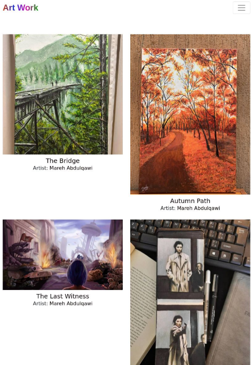

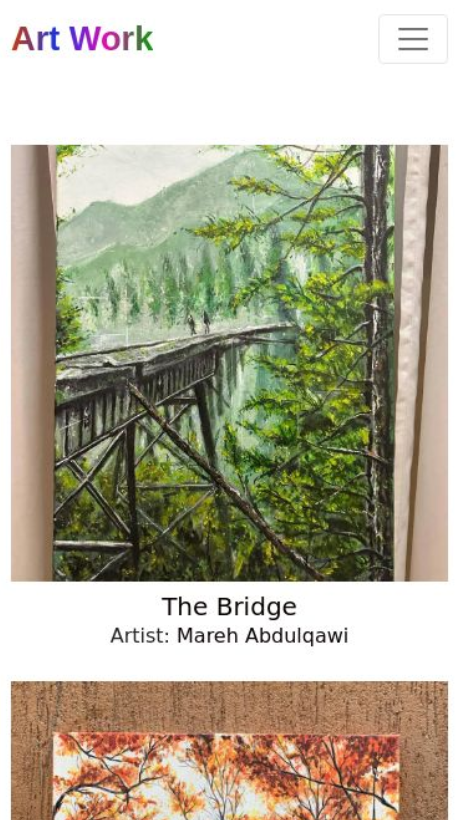

## Purpose

The website provides a platform for artists (logged-in users) to showcase and manage their artworks and provide feedback on others' artworks through comments. Unauthenticated visitors can browse all artworks in detail including artist email addresses (if available) for direct inquiries about specific artwork.

All users, regardless of their authentication status, can contact the website administrator through the dedicated "Contact Us" form.

## Artwork Visuals
Homepage Artworks List View
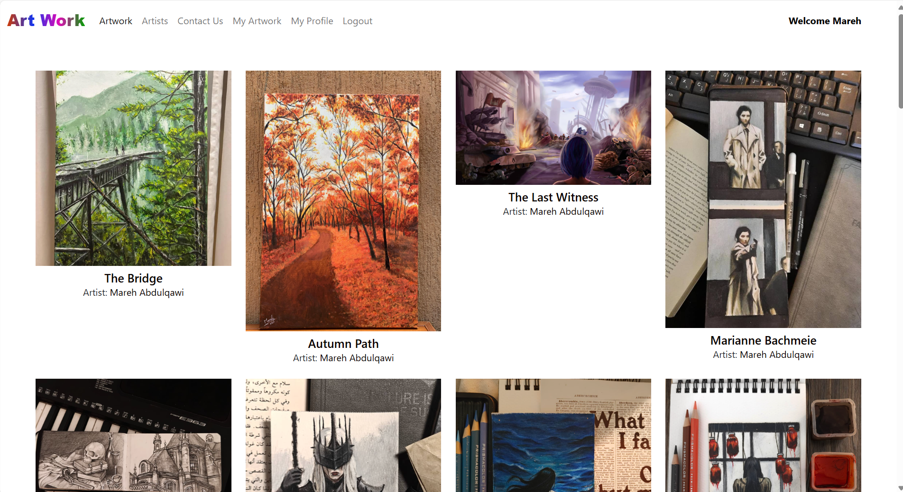
Login as a artist

Viewing the artists List

Viewing an artist's artworks List

Add a new artwork

An Artwork Details Page and Edit or Delete an Artwork

Logout Page
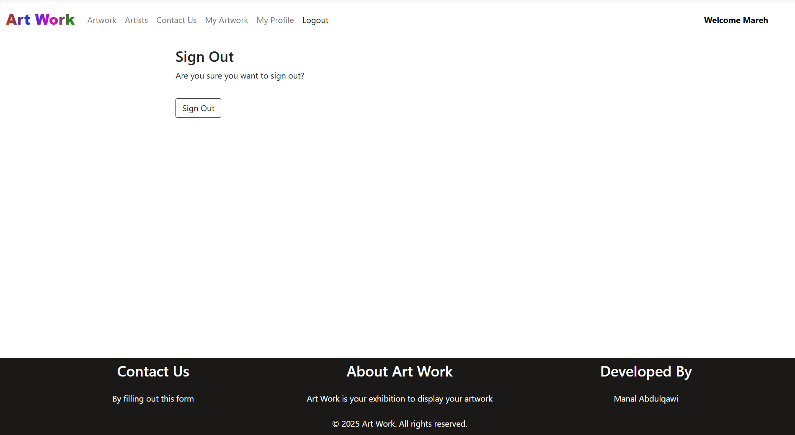
Signup Form
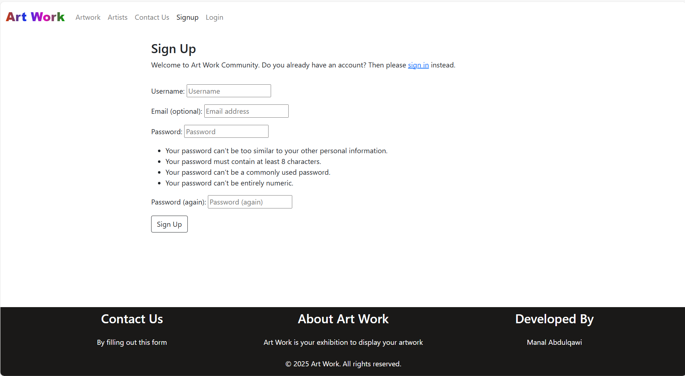
Contact Us Form
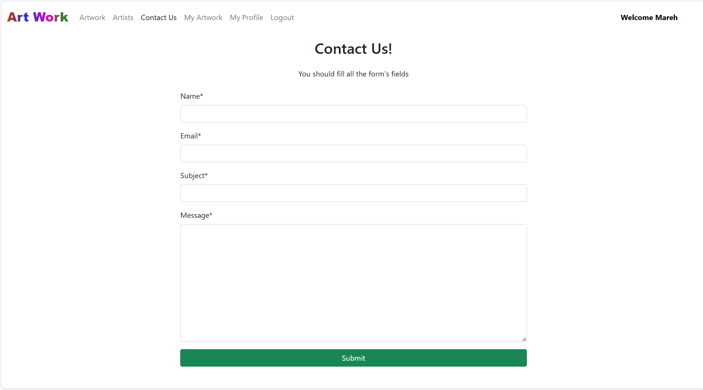
View and Add Comments

Edit and Delete Comments

Artist Profile Page

# Agile Framework and Planning

## User Goals / Project Goals
User Goals

- Browse artworks and view comments as a visitor
- Manage artworks and comments as an artist or administrator
- Update artist details, including first name, last name, and email, to facilitate communication with others
- Browse artworks by a selected artist
- Use the Contact Us form to communicate with the website administrator

Project Goals

- Build a functional and interactive Artwork Exhibition Platform
- Implement user registration for artists
- Optimize application performance
- Conduct testing and debugging
- Deploy a live, accessible application
- Ensure accessibility for all users

I used Agile frameworks to organize and manage the project efficiently. GitHub Projects was the primary tool used for this purpose.

## Agile Framework

- Artwork User Stories
[Artwork User Strories](https://github.com/users/ManalAbdulqawi/projects/3/views/1) 
- I created user stories and acceptance criteria to cover all the minimum viable product tasks (Version 1).
- I then created 3 x columns called, 'Todo', 'In Progress' and 'Done'.
- I created a workflow, which instructed that when an issue (User Story) was created and connected to the Artork Community Project it would automatically go into the 'Todo' category. I then can edit the issues and move them along to 'In Progress' and 'Done'. This approach helped me keep my workflow organised and focus on delivering these features.

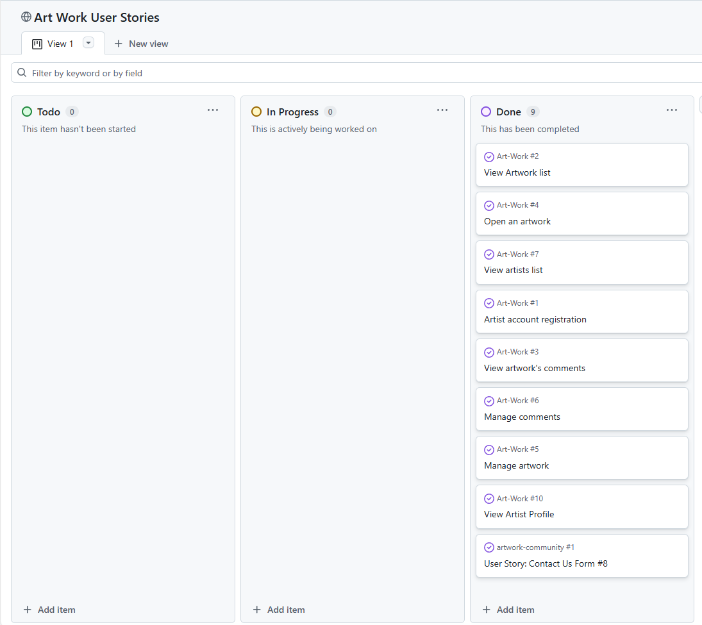

See The List of my 'User Stories' on Github.

Examples of Some User Stories with their Acceptance criteria

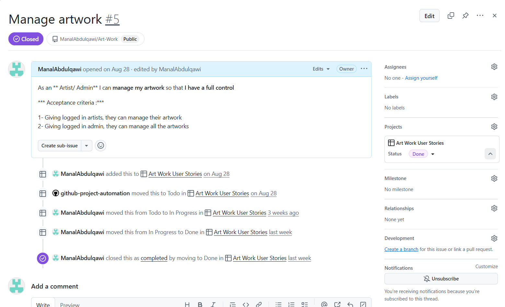

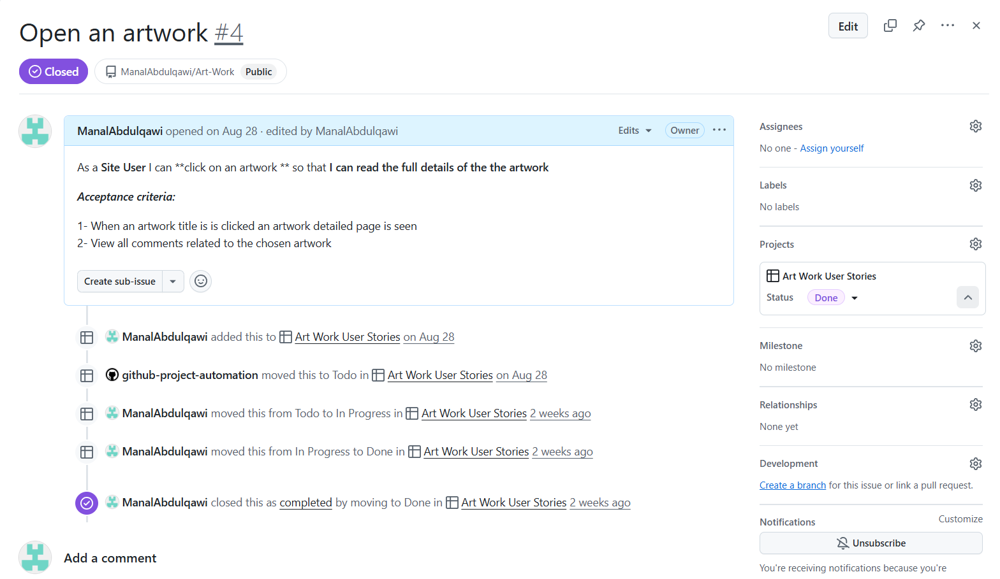

## Features

1. **View Artworks List:** Users can browse all artworks displayed on the homepage, including images, titles, and artist names.

2. **View Artwork Details and Comments:** Users can select an artwork to see detailed information such as description, size, and publication date. They can also view comments related to that artwork.

3. **View List of Artists:** Users can see a list of all artists who have added artworks. Clicking on an artist's name will display all artworks by that artist.

4. **Manage Artworks and Comments:** Logged-in users (artists/admins) can perform CRUD (Create, Read, Update, Delete) operations on their artworks and comments.

5. **Update Artist Details:** Logged-in artists can update their profile information, including first name, last name, and email. This enables viewers to contact them directly regarding their artworks.

6. **Contact Us Form:** Users can reach out to the website administrator by filling out a contact form with their name, email, subject, and message.

7. **Feedback Messages:** Logged-in users receive feedback messages after actions to enhance the user experience.

8. **Account Registeration:** Users can signup as artists, that will allow them to add and manage their artworks and comments.

9. **Responsive and User-Friendly Design:** The website features a simple, clean design that focuses attention on artworks and adapts seamlessly to various screen sizes and devices for optimal usability.

## Technologies Used

- **HTML5**: For structuring the webpage content.
- **Boostrap and Custome CSS**: For styling and enhancing the visual appeal, I used Bootstrap to style my project because it made it easy to create a clean, organised, and responsive design.
- **JavaScript**: To create dynamic URLs.
- **Django**: To build robust, scalable, and secure web applications using Python by offering a wide range of built-in features, such as an ORM (Object-Relational Mapping), an admin interface, authentication, URL routing, and more. Django follows the Model-View-Controller (MVC) architectural pattern, which helps organize code efficiently and promotes reusability. It is widely used for developing everything from simple websites to complex, data-driven applications.
- **Cloudinary**: To store the artworks images.
- **Postgesql Database**: Used to store and manage all website data efficiently and securely.
- **Django Crispy Forms**: (a third-party package) for the Django web framework that simplifies the process of creating and styling forms.
- **Heruko**: Used to deploy and host the website in a live environment.

# Project Life Cycle

## Planning and Analysis

I decided to develop an Artwork website featuring CRUD functionalities, allowing logged-in users (artists) to display and manage their artworks. The project idea was inspired by my sister's Instagram profile and [Jacksons Gallary Art](https://gallery.jacksonsart.com/art/)

## Define Requirements
This phase transforms the outcomes of planning and analysis into clear, actionable requirements by developing user stories. You can view the artwork-related user stories here: [Artwork User Strories](https://github.com/users/ManalAbdulqawi/projects/3/views/1)

## Design
The design phase translates the gathered requirements into detailed wireframes and an Entity Relationship Diagram (ERD). Here are some visual representations:

### Artworks List Homepage Wirframe

### Artwork Detail Page Wireframe

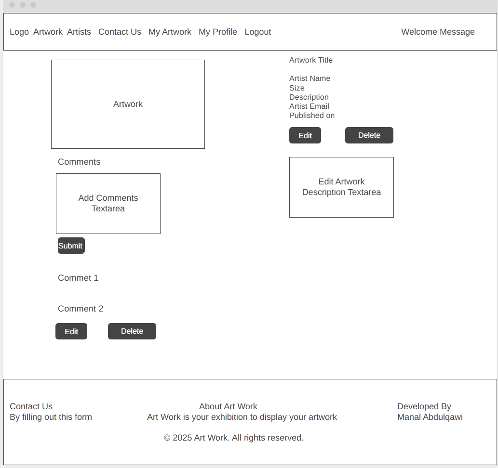

### Entity Relationship Diagram

## Development
I created a GitHub repository and cloned it locally to develop the website using the Django framework. The development process included:

Building models for artworks, comments, and ContactRequest
Coding views to handle CRUD operations and render templates
Focusing on CRUD functionalities, allowing logged-in users to create, read, update, and delete their artworks and comments.For example:  

- Users (artists) can add new artworks with details like title, image, description, and size.
- View all artworks and individual details.
- Edit or delete their own artworks and comments.

Sample Code Snippets:

### Models.py
The Artwork model for example captures artwork details such as title, size, description, and the user who added it.
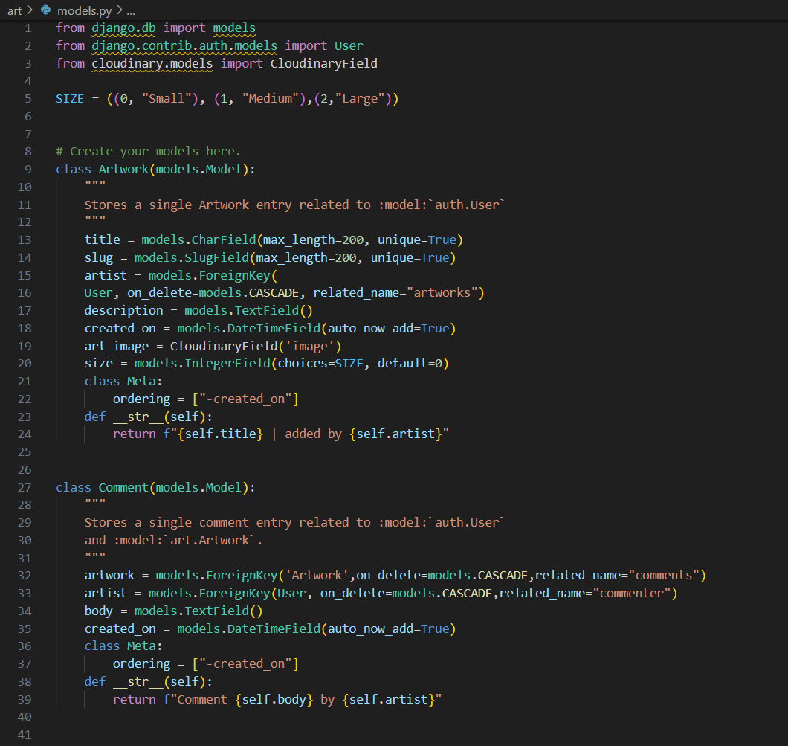

### forms.py
Manages user input for comments and artworks, using Django Crispy Forms for improved styling and validation.

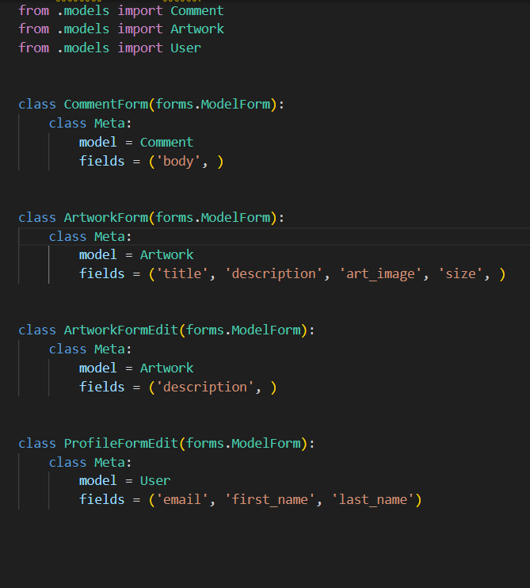

### views.py
Handles displaying artworks, uploading new ones, and rendering forms with Bootstrap styling for responsiveness.

- Upload an artwork by providing details such as title, image, description, and size, and view all artworks created by the artist.
Users can browse a list of all their artworks and add new ones using a Django Crispy form, which includes fields for the title, image, description, and size. The Artwork model stores this information and associates each artwork with the user who uploaded it. Bootstrap is utilized for styling the forms to ensure a responsive and user-friendly layout.

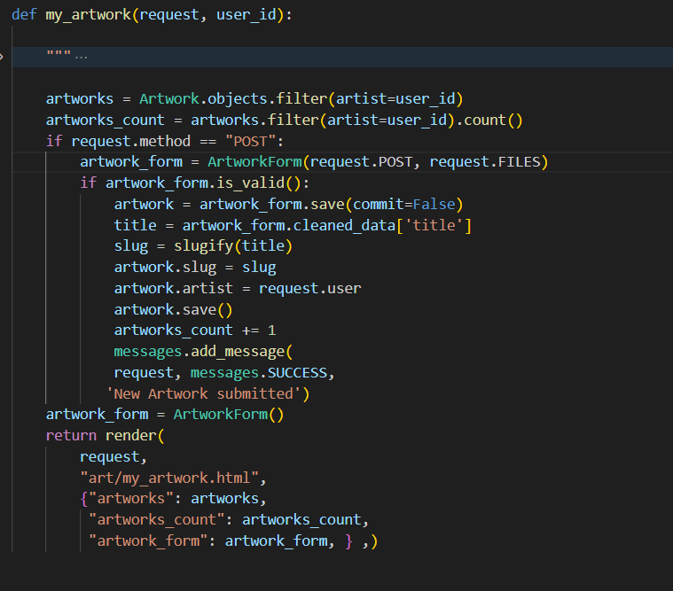

### The my_artworks View Function's Template Rendering Code

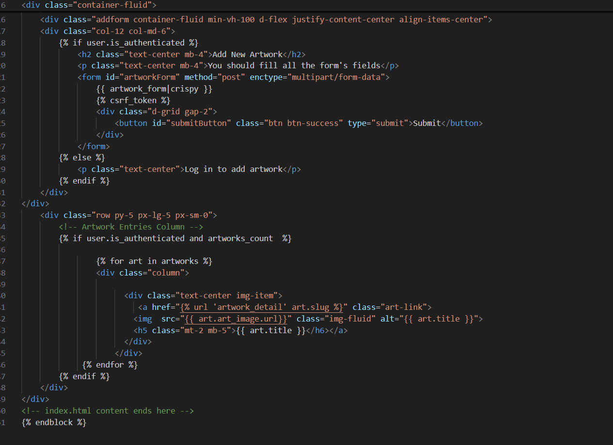

